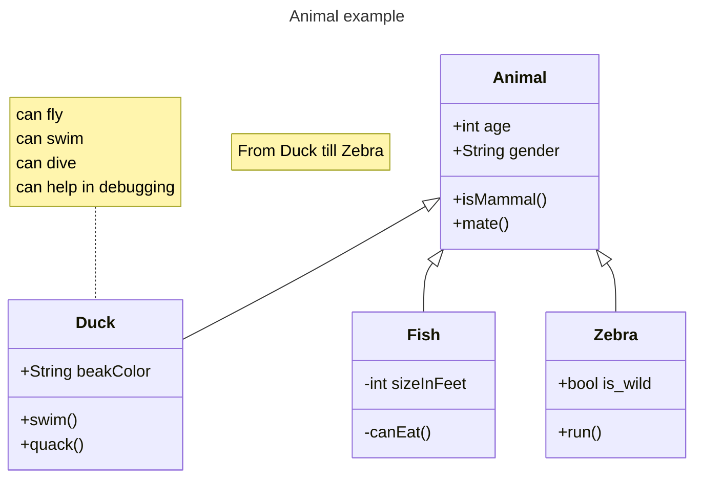

# Trabalho-POO-python-LPN
Trabalho em grupo da disciplina de POO em python

## Contexto
<!-- Aqui você coloca uma descrição detalhada do projeto -->

## Como Usar
<!-- Aqui você descreve como seu projeto deve ser utilizado -->
Bla bla bla... para mais detalhes, dê uma olhada na nossa [documentação detalhada](docs/documentacao_detalhada.md)

## Diagrama de Classes
Você pode usar [mermaid](https://mermaid.ai/open-source/syntax/classDiagram.html) e renderizar o diagrama de classes aqui no github ou usar [PlantUML](https://plantuml.com/class-diagram) e gerar [aqui](https://editor.plantuml.com/) e depois salvar a imagem. Se quiser, pode colocar em outro arquivo como [nesse exemplo](docs/diagrama_classes.md)

## Equipe
<!-- Aqui você coloca seu nome e link para o perfil -->
[Nathan](https://github.com/costanathan430-glitch)
[R. Araujo](https://github.com/araujorayza)

08/10/2026
